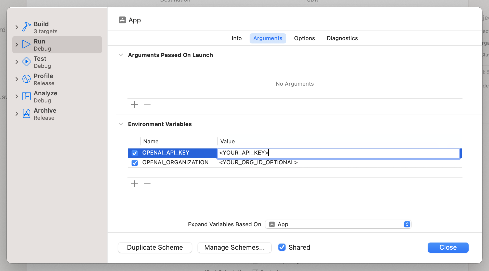

# CoolOpenAIKit


Because the name `OpenAIKit` was already taken...

A *cool* Swift package and set of utilities for [OpenAI's API](https://beta.openai.com/docs/introduction).

## Installation
Add the dependency to Package.swift:

~~~~swift
dependencies: [
    ...
    .package(url: "https://github.com/chrszlz/cool-openai-kit", from: "1.0.0")
],
...
targets: [
	...
    .target(
    	name: "App", 
    	dependencies: [
        	.product(name: "CoolOpenAIKit", package: "cool-openai-kit"),
    	]
    ),
~~~~

## Setup

⚠️ OpenAI recommendeds adding your API key to your environment, rather than hard-coding the value in code. This is very easy and ensures your keys stay safe.

**Add API Key and Organization as Environment Variables from Xcode's Scheme Editor**


- `OPENAI_API_KEY`: your OpenAI API key
- `OPENAI_ORGANIZATION`: YOUR OpenAI organization id (optional)

`OPENAI_ORGANIZATION` is for users who belong to multiple organizations, you can pass a header to specify which organization is used for an API request



Now, upon initialization, the `OpenAI.Client` will automatically grab `OPENAI_API_KEY` and `OPENAI_ORGANIZATION` from your env.

~~~~swift
let client = OpenAI.Client() // *magic*
~~~~

[More about Environment Variables in Swift](https://www.swiftdevjournal.com/using-environment-variables-in-swift-apps/)

**(Not recommended) Manually add API Key and Organiation**
~~~~swift
let configuration: OpenAI.Configuration = .init(
    apiKey: "<OPENAI_API_KEY>",
    organization: "<OPENAI_ORGANIZATION>" // optional
)
let client = OpenAI.Client(config: configuration)
~~~~

## Usage

The primary way to interact with the library is the `OpenAI.client()` object.

This client contains the properties that let you quickly access the API handlers.

### Models

~~~~swift
import CoolOpenAIKit

let client = OpenAI.Client()

// List all models
let models: [Model]? = try await client.models.list()
print(models)

// Retrieve single model
let model = try await client.models.retrieve(model: "text-davinci-003")
print(model)
~~~~
[Learn more about models.](https://beta.openai.com/docs/api-reference/models)


### Completions

```swift
let choices = try await client.completions.create(
	.davinci, 
	prompt: .basic(prompt: "What color are your eyes?"), 
	maxTokens: 100, 
	temperature: 0.5, 
	topP: 1, 
	n: 1, 
	presencePenalty: 0, 
	frequencyPenalty: 0
)
print(choices)


// Or create Completion Request separately
let prompt: Completions.Prompt = .basic(prompt: "What color are your eyes?")
let request = Completions.Request(
    model: .davinci,
    prompt: prompt,
    maxTokens: 100,
    temperature: 0.5,
    topP: 1,
    n: 1,
    presencePenalty: 0,
    frequencyPenalty: 0
)
let choices = try await client.completions.create(request)
print(choices)
```
[Learn more about text completion](https://beta.openai.com/docs/guides/completion).

### Completion Handler Alternatives

```swift
// List all models
client.models.list { models in
    print(models)
}


// Text Completion
let prompt: Completions.Prompt = .basic(prompt: "What color are your eyes?")
let request = Completions.Request(
    model: .davinci,
    prompt: prompt,
    maxTokens: 100,
    temperature: 0.5,
    topP: 1,
    n: 1,
    presencePenalty: 0,
    frequencyPenalty: 0
)
client.completions.create(request) { choices in
    print(choices)
}
```

## Error handling
Simply ensure you catch errors thrown like any other throwing function

~~~~swift
do {
   let models = try await client.models.list()
   print(models)
} catch {
    print(error)
}
~~~~

## Supported Endpoints

| Function                            | Description                                                                                                             | Endpoint                                   |
| ----------------------------------- | ----------------------------------------------------------------------------------------------------------------------- | ------------------------------------------ |
| `.models.list()`                    | Lists the currently available models, and provides basic information about each one such as the owner and availability. | `GET` `/models`                            |
| `.models.retrieve(:)`               | Retrieves a model instance, providing basic information about the model such as the owner and permissioning.            | `GET` `/models/{model}`                    |
| `.completions.create(:)`            | Creates a completion for the provided prompt and parameters                                                             | `POST` `/completions`                      |

## Completeness

- [x] Models
- [x] Completions
- [ ] Edits
- [ ] Images
- [ ] Embeddings
- [ ] Files
- [ ] Fine-tunes
- [ ] Moderations
- [ ] Test cases

## Tests

Basic, but working.

## Contributing

Make a PR, but make it *cool*

## License

This software is copyright (c) 2023 [Chris Zelazo](https://chrz.io).

For copyright and license information, please view the **LICENSE** file.
